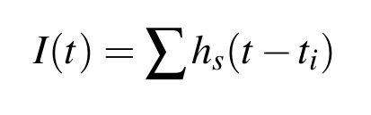

# Cat-V1-Simple-Cell
Simulation of cat V1 simple cell and Receptive Field.

This simulation was part of a study for the characterization of the presynaptic input and the determination of the neuronal operational mode and information representation in the cat V1 simple cells.

## Table of Contents

1. [Background](#background)
    
    1.1 [Primary visual cortex](#primary-visual-cortex)
    
    1.2 [Orientation selectivity of neurons in the visual cortex](#orientation-selectivity-of-neurons-in-the-visual-cortex)

2. [Implementation](#implementation)

    2.1 [Simulation details](#simulation-details)

    2.2 [Dependencies](#dependencies)

    2.3 [Execution](#execution)

3. [Results](#results)

## Background

### Primary visual cortex
The visual cortex can be described at several levels of functional organization. The primary visual cortex, also known as visual area 1 (V1) is considered to be the first level of cortical processing of visual information. V1 neurons receive their main visual input from the lateral geniculate nucleus of the thalamus (LGN) and send their main output to subsequent, higher visual areas and subcortical structures e.g., V2, V3, MT etc.

Cat primary visual cortex drew a lot of attention, due to the fact that the majority of cells in layer 4, the cortical layer that receives the dominant LGN input, are highly selective for stimulus orientation, although the same is not true in many other species.

### Orientation selectivity of neurons in the visual cortex

A remarkable attribute of V1 neurons is their orientation selectivity, which does not apply to the relay cells of LGN, that provide the most information to the cortex. This property was first studied by Hubel & Wiesel [2], who proposed a simple model, which still remains at the center of a long-standing controversy over the synaptic mechanisms that underlie the orientation selectivity.

#### Simple cells

Simple cells are characterized by the elongated, adjacent ON and OFF subfields of their receptive fields. The subfields are positioned alongside each other, with their long axes rotated in an angle, that determines the preferred orientation of the cell. An illustration the simple cell receptive field is shown below. Simple cells’ receptive fields are derived from the receptive fields of geniculate relay cells. An ON subfield consists of several ON-center relay cells, whose receptive field centers are aligned along the same region. Subsequent studies provided further support to the above statement. Other arrangements of the subregions are also possible, e.g., a central OFF region surrounded by ON regions, or one ON and one OFF region.


Figure adopted from [2].

A simple cell is excited when light spots fall in the ON area and dark spots on the OFF area. In the case of the reverse pattern of stimulation (dark on ON and light on OFF), the neuron is inhibited. This is also referred to as the push-pull mechanism.

#### Complex cells

Complex cells are selective for orientation and spatial frequency, similar to the simple cells, although their selectivity cannot be directly predicted from the substructure of their receptive field [2]. Complex cells receive input from several simple cells and can be modeled by spatial pooling of simple cells, with overlapping receptive fields but different arrangements of ON and OFF regions [3].

For the purposes of this work, we are focused on the operational mode of simple cells, only.

## Implementation

### Simulation details

The simulation consists of a V1 simple cell, modeled by a Leaky Integrate-and-Fire (LIF) neuron, receiving presynaptic input from LGN cells of centre-ON or centre-OFF type. Presynaptic spike trains were generated by inhomogeneous Poisson processes, whose rate was modulated by the stimulus and position of the LGN receptive fields at the current time.

#### Neuron model

The V1 simple cell was defined as a LIF model using the BRIAN simulator [4], with membrane time constant $τ_m$ , spike threshold $V_{th}$ , refractory period $τ_{ref}$ , reset potential $V_{reset}$ and membrane resistance $R_m$ .


The synaptic input current to the neuron was defined as the summation of $α$-function shaped postsynaptic currents (PSC), described by



where $t_i$ is the time of presynaptic action potentials and $h_s(t)$ is the PSC kernel


where $w$ is the synaptic weight and $τ_s$ the synaptic time constant. $h_s(t)$ peaks at value determined by $w$ at time equal to $τ_s$ . Excitatory and inhibitory synapses may have different weight and time constant.

#### Stimulus and receptive fields

The neuron was stimulated by sinusoidal grating varying both in space and time. The stimulus is described by


where $x$ and $y$ are the coordinates on the grid; $t$ is the time; $K$ and $ω$ are the spatial and temporal frequency; $Θ$ and $Φ$ are the orientation and spatial phase of the grating; $A$ is the contrast amplitude. Fig. 3.7 is an illustration of the stimulus, showing the effect of each parameter.


Adapted from Fig. 2.8 of [1].

The spatial structure of the receptive fields of the LGN cells were captured by the difference of two Gaussians (DoG), adapted from the spatiotemporal LGN model of [5].


and parameter values $σ_{center} = 10.6’$, $σ_{surround} = 31.8’$ and $K_{center} / K_{surround} = 17/16$. The sign $±$ determines the type of the receptive field, center-ON (+) and center-OFF (-). The result was then normalized, so that the sum of absolute values is one, in order to control the firing rate. Fig. 3.8a illustrates a center-ON spatial receptive field.


(a) A center-ON spatial receptive field modeled as a DoG. The positive and
negative areas are colored red and blue, respectively. (b) Illustration of the stimulus and receptive fields. On the left side there is one center-ON receptive field (with red/positive center and blue/negative surround area) and on the right one center-OFF receptive field (with blue/negative center and red/positive surround area). The black(=-1) and white(=1) stripes represent the stimulus used in the simulations.

The firing rate of each LGN cell at each time is equal to the sum of the element-wise product of the receptive field kernel with the stimulus, negative firing rate set to zero. The optimal stimulus for a center-ON receptive field, in order to achieve the maximum firing rate is white (=1) in the center and black(=-1) in the surrounding area. This position was never achieved because of the stimulus’ shape, i.e., stripes instead of circles. As shown in above figure, the spatial frequency of the stimulus was set so that the width of each black and white stripe is equal to the diameter of the center of each receptive field and the surrounding area falls into the opposite colored stripe. 

For the purposes of the experiments, the receptive fields were placed in two rows; a row with excitatory center-ON and inhibitory center-OFF receptive fields and a row of the opposite combination, inhibitory center-ON and excitatory center-OFF. The optimal case of the stimulus for excitation is when there is light on the first row (activation of excitatory center-ON) and dark on the second row (activation of excitatory center-OFF), thus the V1 cell receives only excitatory input. On the other hand, the optimal case for inhibition is when the first row is in the dark (activation of inhibitory center-OFF) and light on the second row (activation of inhibitory center-ON).

### Dependencies

For installing the dependencies from the `requirements.txt` file:

```
pip install -r requirements.txt 
```

* If you have Anaconda the installation of dependencies is often quite straight forward since most them are already included.

* Tested only on Ubuntu 20.04, but should work on other platforms, as well.

### Execution

* Parameters of the simulation can be set by `v1_simple_cell/params.py`

* Run the simulation by executing `v1_simple_cell/simulation.py`

## Results


Membrane potential of the simulated V1 neuron for different stimulus orientations. The time of presynaptic excitatory and inhibitory input, each one corresponding to a receptive field, is shown beneath the membrane potential by blue and red lines, respectively. The preferred orientation of the neuron is 0° (and opposite 180°), where the cell particularly active. 

Note that simulation parameters have not been optimized.

## Author

George Hadjiantonis

## License
This project is licensed under the MIT License - see the `LICENSE.md` file for details.

## References

[1] P. Dayan and L. F. Abbott. Theoretical neuroscience: computational and mathematical modeling of neural systems. MIT Press, Cambridge, MA, 2001.

[2] D. H. Hubel and T. N. Wiesel. Receptive fields, binocular interaction and functional architecture in the cat’s visual cortex. The Journal of Physiology, 160(1):106–154, 1962.

[3] J. A. Movshon, I. D. Thompson, and D. J. Tolhurst. Receptive field organization of complex cells in the cat’s striate cortex. The Journal of Physiology, 283(1):79–99, 1978.

[4] M. Stimberg, R. Brette, and D. F. Goodman. Brian 2, an intuitive and efficient neural simulator. Elife, 8:e47314, 2019.

[5] Worgotter and C. Koch. A detailed model of the primary visual pathway in the cat: comparison of afferent excitatory and intracortical inhibitory connection schemes for orientation selectivity. Journal of Neuroscience, 11(7):1959–1979, 1991.